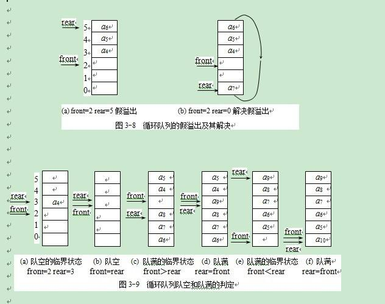

 
/*
 * @Author: HH.wangye 
 * @Date: 2018-01-19 10:39:34 
 * @Last Modified by: HH.wangye
 * @Last Modified time: 2018-01-19 10:45:42
 */
  

# holidayTest
## 寒假期间打算重新复习一下数据结构，夯实一下自己的算法基础。
### 书籍：数据结构（java版）
### 编程语言：java

第一周期：复习书本内容，掌握大体知识

#### 第一章：线性表
包括：
1. 非递减的两个数组进行归并
2. 单向链表的基本操作
3. 双端链表的基本操作
4. 双向链表的原理（没有编程实现）

#### 线性表小结：
对于线性表这一章，当初在学习的时候，就没有弄明白。不过通过寒假这几天的复习和编码，自己确实理解了很多，不仅仅是指针移动的方式，同时也加深理解了java中对象引用这一知识点。单向链表是最基本的线性表，它的一些基本操作，同样适用于后续的链表结构。双端链表就是说同样存在一个last引用指向最后一个节点，不过双向链表存在缺陷，无法从后面进行删除（排除遍历删除），因为没有从后指向前的指针。对于这个问题，双向链表进行了很好地解决，因为其存在由后向前的指针，但是双向链表的删除和插入都需要操作多个引用（最多四个，空表除外），双向链表不分没有编码实现，算法学习是个漫长的过程，日后再说。循环链表java版的数据结构并没有提及，其实也很简单，就是在单向链表的基础上，尾节点的指针指向first。

#### 第二章：数组

1. java中数组的基本操作 
在java编程思想中已经练习使用过，此处没有花时间研读，直接跳过。
 
2. 基于数组的查找算法：
    * 顺序查找 
    * 二分查找 
    在二分查找中,发现了一个自己已经遗忘的知识点。return关键字，return关键字存在以下几个功能： 
    1. 返回某个函数所需的值 
    2. 中断函数执行或者中断循环。 
     因为return后面的语句不再执行，故此功能2可以理解。

#### 第三章：队列和栈
1. 栈的基本操作 
    * 栈需要使用栈顶指针，通过栈顶指针便可以实现出栈进栈的操作。进而实现逆序和正序有关的问题。
    * 先进后出
    * 对于正序输入,逆序输出的问题都可以考虑使用栈的方式来解决。
    * 字符匹配利用栈的思想实现。
        * 其实就是利用栈先进后出的特性，左面的符号先进栈，遇到右面的符号就出栈，然后对比，比如以下字符串："wy{[()]}",那么其入栈出栈的顺序便如下表所示：

        | 符号        | 入栈   |  出栈 |
        | --------   | -----:   | :----: |
        | w        |        |       |
        | y        |        |       |
        | {       | {       |       |
        | [      | [        |       |
        | (       | (       |      |
        | )       |         |   )    |
        | ]       |         |   ]    |
        | }      |         |   }   |

2. 队列的基本操作 
队列中其思想便是先进先出，但是与栈不同的是，队列的出入必须在两端进行，插入的一端有尾指针负责，输出的一端有由指针负责。再插入和输出的时候，具体的指针操作都适合栈类似的。例如插入时，先移动指针，再插入数据。输出时，先输出数据在移动指针。同时队列满时front==near。 
队列中存在假溢出，例如下图所示：

 
优先级队列： 
队列中的处理顺序是按照优先级来排布的。

### 第四章：基本排序

1. 冒泡排序： 
每次相邻两个元素互相比较，将较大或者较小的值后移，外层循环控制需要进行比较的元素。内层循环进行比较。
2. 选择排序 
外层循环时，选择当前的元素为最小元素。内循环依次比较，找到最小的话，就进行交换。
3. 插入排序 
插入排序的思想很简单，无非就是将数组分为已排序和未排序两部分，这两部分中，每次从未排序中选取一个待排序元素，并在已排序数组中查找，然后将其在合适位置插入。

### 第五章：递归思想
 
对于递归，必须提供一个终止的条件，叫做基值。每当遇见基值时，直接退出递归。 
1. 调用自身 
2. 为了逐步解决小的问题 
3. 如果到了存在某个简单算法解决的一步，则直接返回值。 
 
例子： 
1. 三角数字 
2. 阶乘 
3. 变位字（未实现），就是将给定的字符串进行全排列 
4. 递归思想实现二分查找 

    

